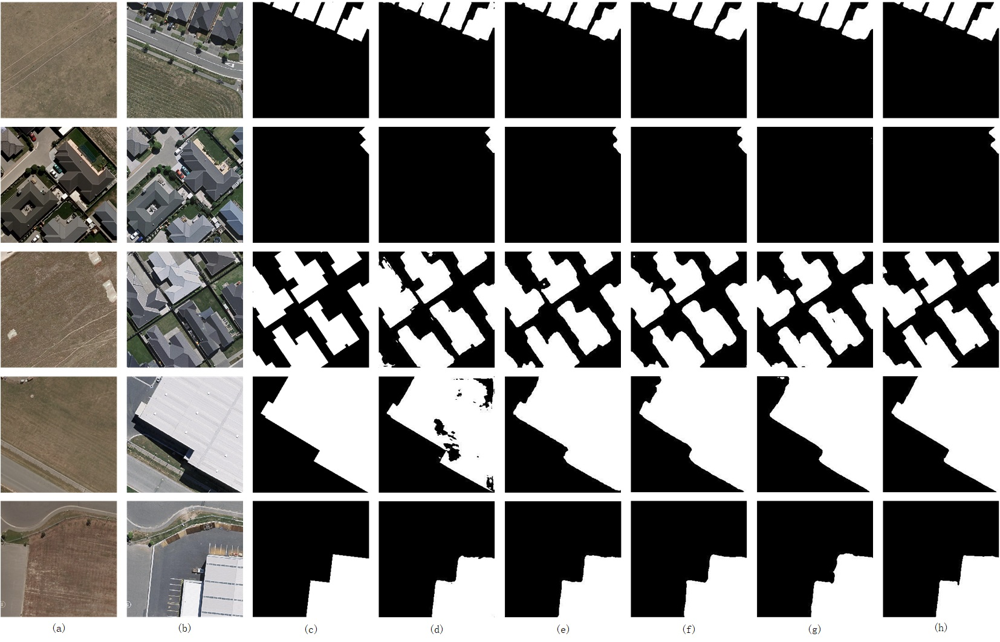

# EGCTNet: Building Change Detection based on an Edge-Guided Convolutional Neural Network combined with Transformer
(Posted in Remote Sensing)

Here, we provide the pytorch implementation of the paper: Building Change Detection based on an Edge-Guided Convolutional Neural Network combined with Transformer.

For more information, please see our paper at [arxiv](https://www.mdpi.com/2072-4292/14/18/4524). 

## Network Architecture


## Quantitative & Qualitative Results on LEVIR-CD and WHU-CD
LEVIR-CD

WHU-CD

## Requirements

```
Python 3.8.0
pytorch 1.10.1
torchvision 0.11.2
einops  0.3.2
```

Please see `requirements.txt` for all the other requirements.


## Train on LEVIR-CD

You can run the script file by `main_cd.py` in the command environment.


## Evaluate on LEVIR

You can run the script file by `eval_cd.py` in the command environment.


## Dataset Preparation

### Data structure

```
"""
Change detection data set with pixel-level binary labels；
├─A
├─B
├─label
├─label_edge
└─list
"""
```

`A`: images of t1 phase;

`B`:images of t2 phase;

`label`: label maps;

`label_edge`: using the Canny edge detection operator on theusing the Canny edge detection operator on the label maps;

`list`: contains `train.txt, val.txt and test.txt`, each file records the image names (XXX.png) in the change detection dataset.

### Data Download 

LEVIR-CD: https://justchenhao.github.io/LEVIR/

WHU-CD: https://study.rsgis.whu.edu.cn/pages/download/building_dataset.html

DSIFN-CD: https://github.com/GeoZcx/A-deeply-supervised-image-fusion-network-for-change-detection-in-remote-sensing-images/tree/master/dataset

## License

Code is released for non-commercial and research purposes **only**. For commercial purposes, please contact the authors.

## Citation

If you use this code for your research, please cite our paper:

```
MDPI and ACS Style
Xia, L.; Chen, J.; Luo, J.; Zhang, J.; Yang, D.; Shen, Z. Building Change Detection Based on an Edge-Guided Convolutional Neural Network Combined with a Transformer. Remote Sens. 2022, 14, 4524. https://doi.org/10.3390/rs14184524

AMA Style
Xia L, Chen J, Luo J, Zhang J, Yang D, Shen Z. Building Change Detection Based on an Edge-Guided Convolutional Neural Network Combined with a Transformer. Remote Sensing. 2022; 14(18):4524. https://doi.org/10.3390/rs14184524

Chicago/Turabian Style
Xia, Liegang, Jun Chen, Jiancheng Luo, Junxia Zhang, Dezhi Yang, and Zhanfeng Shen. 2022. "Building Change Detection Based on an Edge-Guided Convolutional Neural Network Combined with a Transformer" Remote Sensing 14, no. 18: 4524. https://doi.org/10.3390/rs14184524

```

## References
Appreciate the work from the following repositories:

- https://github.com/wgcban/ChangeFormer (Our EGCTNet is implemented on the code provided in this repository)

